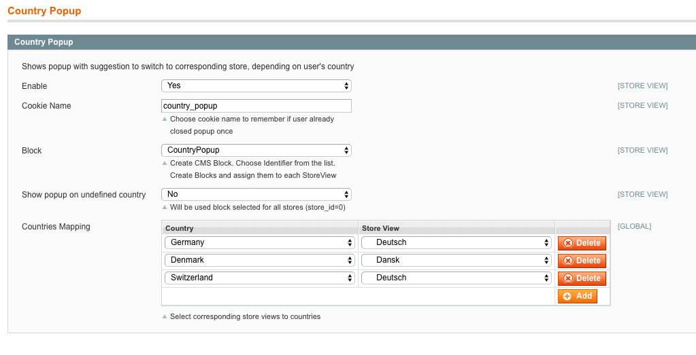

# Country Popup

Shows popup with suggestion to switch to corresponding store, depending on user's country.

By default uses cookie `country_popup` to remember if user already closed popup once (configurable). 

## Configuration 

- Make sure GeoIP database is actualized under `System -> Configuration -> General -> Countries Options -> GeoIP Database Downloaded`.
- Find configuration under `System -> Configuration -> kirchbergerknorr -> Country Popup`.

Configure:

- `Countries Mapping` - Select corresponding store views to countries
- `Block` - Create CMS Block. Choose Identifier from the list. Create Blocks and assign them to each StoreView

 